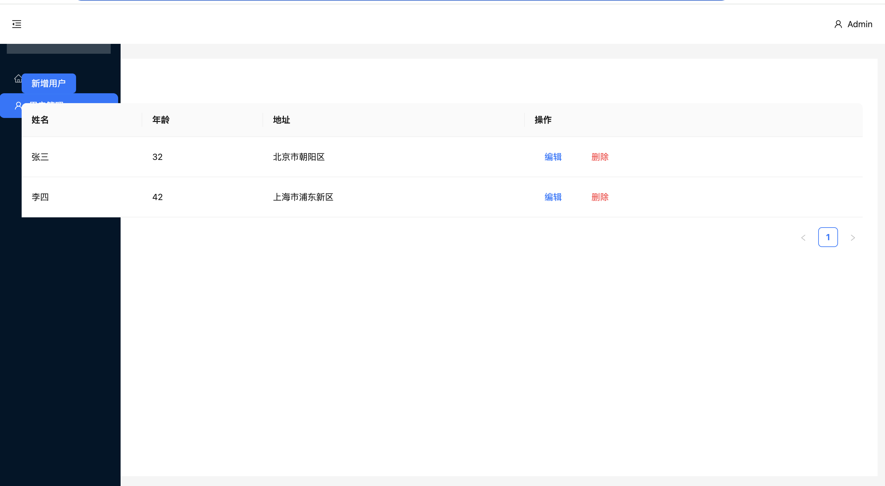
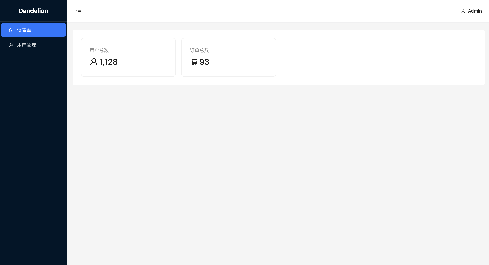
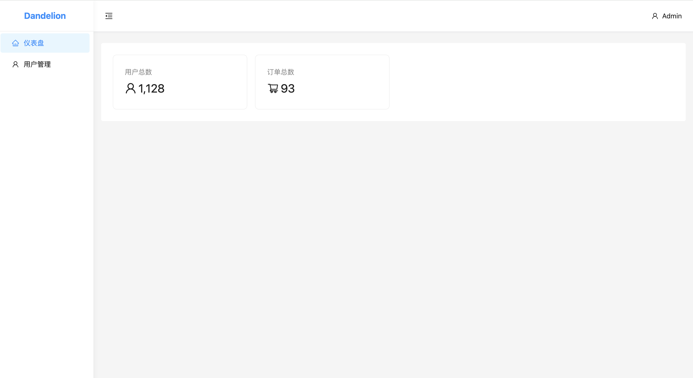
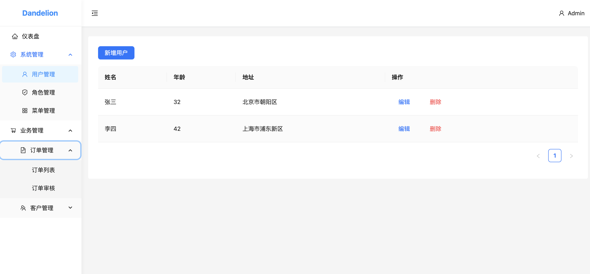
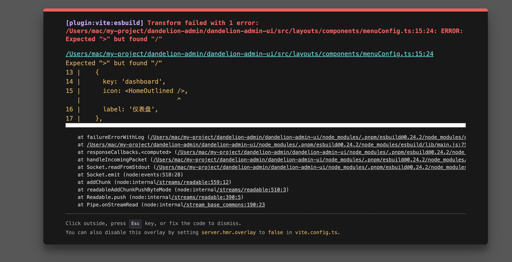
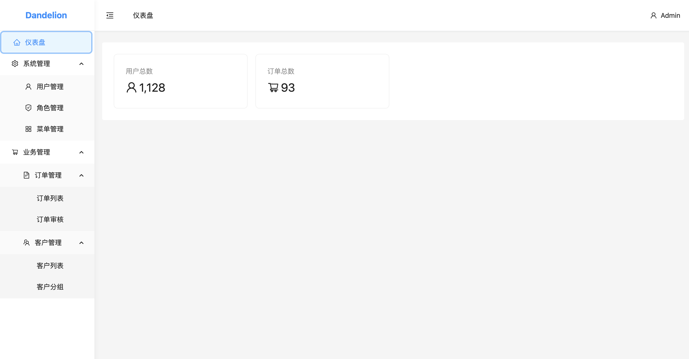
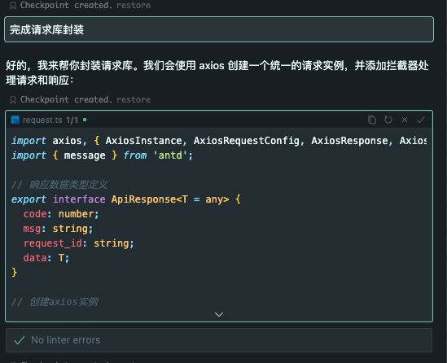
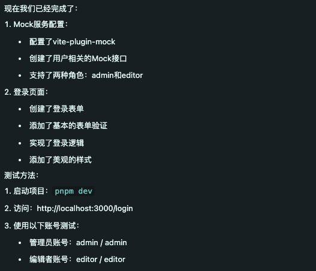
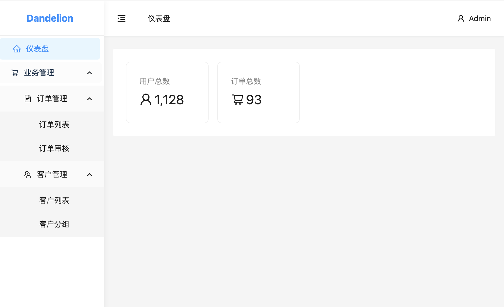
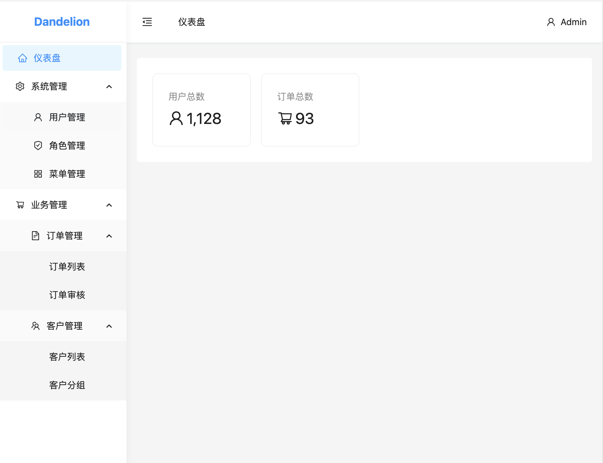

1.创建一个空项目
> 创建一个dandelion-admin-ui的项目，该项目为一个管理后台，采用react + vite + ts + pnpm，样式上采用阿里开源的ant-design，你现在只需要创建一个空项目，不需要样式上的修改，引用需要的组件即可。你可以 创建并运行了

注意：
这里创建完后，没有进行正确的路径运行项目，所以我增加了一个对话
> 注意  你创建完项目后  执行命令应该是在 dandelion-admin/dandelion-admin-ui这个路径下

2. 开始准备项目文档
通常不要一开始就下达开发指令，更应该先进行对话确定需求

> 现在我需要开发一个最基础的管理系统。1.布局主体分为左右两个部分，左边：包含上下两部分，上方主要显示logo以及站点名称，下方则是菜单栏。右边也是上下两部分组成，上方是header，下方是content区域。切换菜单，content区域将展示对应的page。2.需要实现对应request请求api,然后通过mock代理进行数据模拟。后端的响应结构包含code、msg、request_id、data这个几个字段，其中每个接口的数据从data中获取，中间件中进行统一的错误判断，如果code不等于20000，则采用全局的错误提示。3.需要增加权限控制，侧边栏的菜单应该通过api返回的菜单树进行渲染，并且进入到每个页面都应该获取当前页面所拥有的权限code。这些是我目前能想到的需求，现在需要你整理并完善需求，然后把梳理出的方案写入到readme.md中

这时生成了一个对应的开发文档。但我发现其中初始化项目被标记为了未完成，实际已完成。所以我增加了一个对话

> 当前项目已经初始化了，位于dandelion-admin/dandelion-admin-ui这个层级中

这时cursor开始为我下载依赖，并进行基础布局的开发。（pass:这里我预期是只进行目录定位，但cursor进行了开发了）

可以看到效果很差，这是我们则需要进行代码的优化。

3. 开始开发布局以及基础样式
先对已开发的布局进行调整。

> 样式上存在问题，并没有很好的完成左右布局的设定，需要优化下代码

执行完的效果，可以看到整体的布局已经修复完成了：

但我觉得菜单栏的颜色不好看，所以进行了一波调整

> 我期望左边的背景色为白色，菜单被选中时字体色为主题色，鼠标移入移出也需要有变化

执行完的效果：

目前整体效果已经出来了，接下来完成增加一些菜单测试数据，看多层级菜单展示是否正常

> 我期望菜单的测试数据能够多一些层级

这是菜单的开发已经基本完成了，接下来补充上面包屑.

> 增加面包屑功能

出现问题了。

直接把错误丢给cursor

> delion-admin/dandelion-admin-ui/src/layouts/components/menuConfig.ts:15:24: ERROR: Expected ">" but found "/"

修复完成，面包屑的功能已经完成：

根据readme里的步骤，截下来需要完成请求库封装。我们直接下命令（pass:因为readme是对话生成的，有上下文，我们直接让他封装即可）

> 完成请求库封装

可以看到，相应结构也是之前我们预定的

3. 核心功能实现

刚实现了请求库封装，接下来则完成mock服务的配置，以及实现动态菜单

> 完成mock服务的配置，以及实现动态菜单

这里实现完报错了。
出现了错误：
> react-router-dom.js?v=0246ea5f:1192 Uncaught Error: useNavigate() may be used only in the context of a <Router> component.
    at AuthWrapper (AuthWrapper.tsx:11:20)

这里算是我的问题，动态路由应该在模拟登录后实现会比较好。先修复下问题。直接把错误丢给对话.

没能成功修复，只能进行restorele,直接回到第一个对话进行修改。

> 先进行mock服务的配置，然后实现登录页面，在进行数据模拟实现动态菜单

代码生成完后，我们去到登录页面。发现mock应该是有问题的，接口404了，所以问题丢给他。

> request.ts:93 POST http://localhost:3000/api/auth/login 404 (Not Found)

这一步是可以正常登录了，等菜单并没有改为通过接口获取，还是写死的。把这个进行优化。

> 菜单应该通过接口获取，并且不同的账号获取到的模拟数据应该是不一样的。

到动态菜单也算是完成了。（pass:一直漏掉了一个点**git**，在创建项目的时候就应该先初始化git，每个模块完成都应该进行一下提交才对，我们进行下补救）

> 初始化git并进行commit

接下来完善一下路由守卫（跟着文档的顺序进行）

> 添加路由守卫

出现了错误依旧是直接让cursor进行修复。直到pnpm dev 可以正常运行。

到此基本逻辑就已经实现完了。